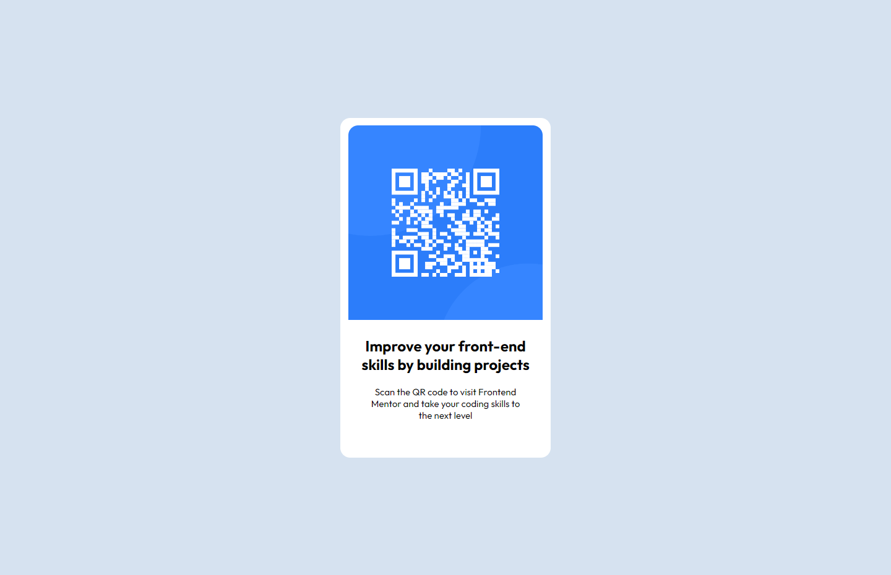

# QR code component

Project developed based on [Frontend Mentor - QRCODE](https://www.frontendmentor.io/challenges/qr-code-component-iux_sIO_H).

Projeto desenvolvido com base no [Frontend Mentor - QRCODE](https://www.frontendmentor.io/challenges/qr-code-component-iux_sIO_H).

[Link do projeto.](https://qr-code-component-jade-sigma.vercel.app)

>DESKTOP

>MOBILE
